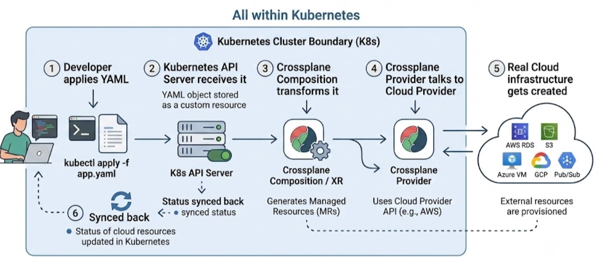
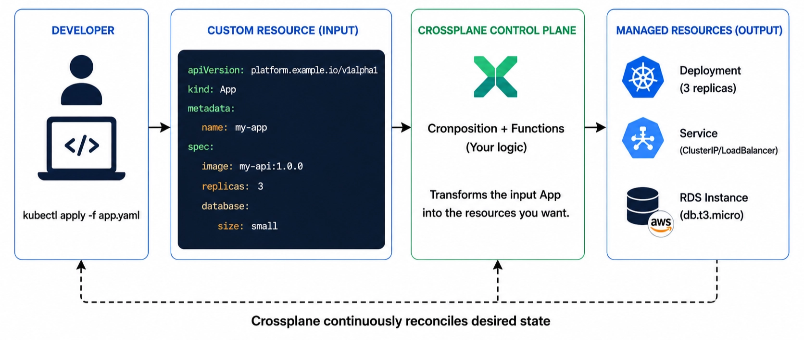
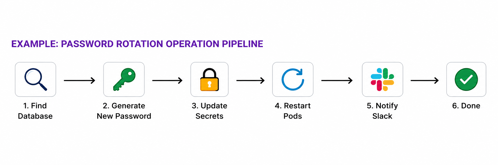

+++
title = "What is Crossplane? Kubernetes for Your Cloud Infrastructure"
date = "2026-06-29"
[taxonomies]
tags = ["infrastructure", "devops", "kubernetes"]
+++
## What is Crossplane? Kubernetes for Your Cloud Infrastructure

Crossplane is a control plane framework for platform engineering.

If you've been working with Kubernetes for a while, you've probably thought — *"I wish I could manage my cloud infrastructure the same way I manage my containers."* That's exactly what Crossplane does.

Let's break it down from scratch.

---

Managing cloud infrastructure and Kubernetes workloads with two completely different tools is exhausting. Your app lives in Kubernetes, but your RDS database, S3 bucket, and Redis cluster live in Terraform — or worse, someone's AWS console session from 6 months ago. Crossplane fixes this by bringing your entire infrastructure under the same Kubernetes-native workflow you already know.

### What's a Control Plane?

As the opening statement suggests Crossplane is a control plan framework for platform engineering, so we need to understand what a control plane is.

A control plane is the part of a system that **decides what should happen** — it doesn't do the actual work itself. It just tells other components what the desired state should be, and they make it happen.

Kubernetes is a great example of this:

- **Control Plane** → API server, scheduler, controller manager
- **Data Plane** → Worker nodes where your containers actually run

When you run:

```bash
kubectl apply -f deployment.yaml
```

You're talking to the control plane. It reads your file, understands you want 3 replicas of your app, and instructs the worker nodes to make it happen. You declared *what* you want — Kubernetes figured out *how* to get there.

---

### So What Does Crossplane Do?

Crossplane extends Kubernetes so it can manage **cloud infrastructure** — not just containers.

With Crossplane, Kubernetes can now manage:

- Your application (as always)
- Your cloud resources — RDS databases, S3 buckets, Redis clusters, Kafka topics, you name it

Instead of using Terraform or clicking around in the AWS console, you declare your infrastructure the same way you declare a Deployment — using YAML, through Kubernetes.

Here is how the pieces fit together:



Every step happens inside Kubernetes. You never leave kubectl.

---

### The Key Value of Crossplane

Here's where it gets interesting.

Crossplane lets you create your **own Kubernetes APIs** — custom resources like `Database`, `Redis`, or `Kafka` — without having to write complex controller software from scratch.

Normally, if you want a custom resource in Kubernetes, you need to write a controller — a piece of software that watches for that resource and knows what to do with it. That's a lot of Go code, a lot of complexity.

Crossplane handles all of that for you. You just define the logic, and Crossplane's built-in reconciliation engine takes care of the rest.

---

**A Day in the Life With Crossplane**

Imagine a developer on your team needs a PostgreSQL database for a new microservice. Without Crossplane, they open a Jira ticket, the infra team provisions it in Terraform, outputs the connection string, someone manually creates a Kubernetes Secret — two teams, three tools, one week later.

With Crossplane, the developer just applies this:

```yaml
apiVersion: platform.example.com/v1
kind: Database
metadata:
  name: my-app-db
spec:
  size: small
  engine: postgres
```

Crossplane reads it, talks to AWS, provisions the RDS instance, creates the Secret, and the developer is connected in minutes. One tool. One workflow.

---

### Crossplane's Four Major Components

Crossplane has four building blocks. You can use all four together or pick just the ones you need.

#### 1. Composition

Composition is how you build your own custom APIs on top of Crossplane.

Say you want a custom resource called `App`. Whenever a developer creates an `App`, your control plane should automatically spin up a Kubernetes Deployment, a Service, and maybe an RDS instance.

Without Crossplane, you'd write a controller for this — and controllers are notoriously tricky to get right. With Crossplane, you instead write a small function whose only job is to **transform an input** (like an `App` resource) into the actual Kubernetes and cloud resources you want. Crossplane's engine handles the reconciliation — creating, updating, and deleting infrastructure as needed.




You focus on the *logic*. Crossplane handles the *machinery*.

#### 2. Managed Resources

Managed Resources are **ready-made Kubernetes custom resources** that Crossplane ships with.

Each one extends Kubernetes to manage a specific external system. For example:

- There's a Managed Resource for AWS RDS instances
- One for GCP Cloud SQL
- One for Azure Blob Storage
- ...and hundreds more

This means you don't have to write a controller to manage AWS or GCP resources — someone already did that work and packaged it as a Managed Resource. You just use it.

You can also combine Managed Resources with Composition to build higher-level custom APIs — like a `Database` API that abstracts away whether it's RDS or Cloud SQL underneath.

#### 3. Operations

This one is a newer concept, and it solves a real pain point.

Here is the problem. Crossplane's default mode is continuous reconciliation — it never stops watching. That is perfect for infrastructure that should always exist. But some tasks are one-time actions, not permanent resources.

Think about rotating a database password. You don't want Crossplane to *continuously reconcile* a password rotation — that makes no sense. You want it to run once, confirm it worked, and stop. That is what Operations are for.

If Composition is like a Kubernetes Deployment — always running, always watching — then an Operation is like a Kubernetes Job. It starts, does its work, reports success or failure, and exits.

Think of an Operation like a Kubernetes Job. It runs, does its work, and finishes. Here's what a password rotation pipeline might look like:




There are three types:

| Type | Behavior |
| --- | --- |
| **Operation** | Runs once |
| **Cron Operation** | Runs on a schedule (like a Kubernetes CronJob) |
| **Watch Operation** | Runs whenever something changes |

#### 4. Package Manager

When you first install Crossplane, it doesn't know anything about AWS, Azure, or GCP. It's just the core engine.

You extend it by installing **packages** — bundles of configuration or code that add new capabilities. Think of it like Helm charts for Kubernetes, or Docker images for containers. Instead of writing everything yourself, you install a package and you're ready to go.

For example, installing the AWS provider package gives Crossplane everything it needs to start managing AWS resources.

---

### **Crossplane vs Terraform — Which One?**

|  | Crossplane | Terraform |
| --- | --- | --- |
| Where it lives | Inside Kubernetes | Separate CLI / pipeline |
| State management | Kubernetes `etcd` | `.tfstate` files |
| Continuous reconciliation | Yes — always watching | No — runs when you trigger it |
| Custom abstractions | Yes — via Composition | Limited — modules only |
| Best for | Teams already on Kubernetes | Teams managing multi-cloud outside K8s |

The honest answer — they're not always competitors. Some teams use Terraform to provision the Kubernetes cluster itself, then use Crossplane for everything running inside it.

### **Want to Try It?**

The fastest way to get started:

bash

```yaml
# Install Crossplane into your cluster
helm install crossplane crossplane-stable/crossplane \
  --namespace crossplane-system \
  --create-namespace
```

From there, install an AWS or GCP provider package and you are managing cloud infrastructure from kubectl within minutes. The official docs at crossplane.io have a solid getting-started guide worth bookmarking.

### Wrapping Up

Crossplane is one of those tools that clicks once you see the full picture. It takes the Kubernetes model you already know — declarative configuration, reconciliation, custom resources — and extends it to manage your entire cloud infrastructure.

If your team is already living in Kubernetes, Crossplane is worth a serious look.

> ***Your YAML already runs your apps. There's no reason it can't run your entire cloud too***
>